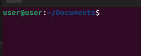

# Day1
## Today I learned about the shell
### the shell
    ▷ The shell is basically a program that takes your commands from the keyboard and sends them to the operating system to perform.
    ▷ "Terminal" or "console" are just programms that launch a shell for you.
    ▷ In this Course, we will use the shell program 'Bash' (Bourne Again Shell).
    ▷ Almost all Linux distributions will default to the 'Bash' shell.
    ▷ There are other shells availble such as ksh,zsh and tsh.
    ▷ Depending on the distribution your shell, prompt might change.
    prompt on bash: 
       username@hostname:Current_directory
        
